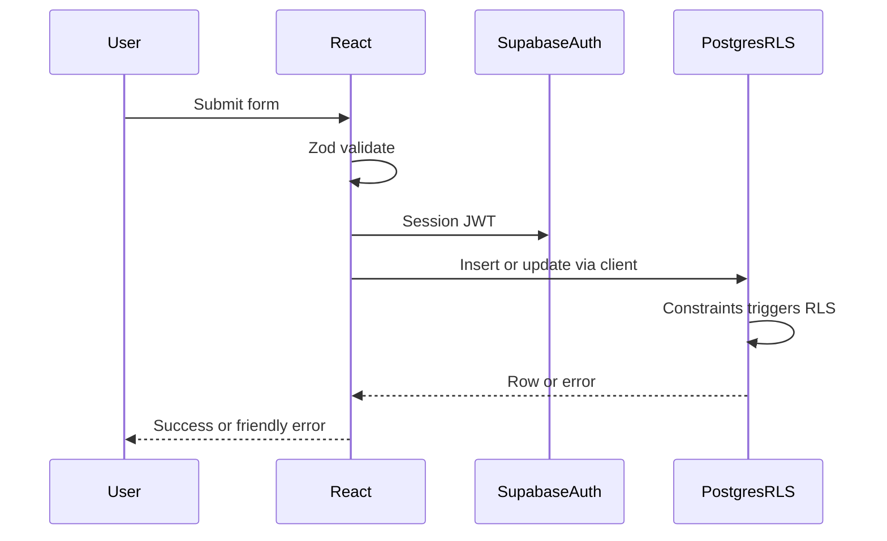

# ARCHITECTURE — KosManage

## Overview

KosManage is a desktop application with a thin native shell and a cloud-backed data plane:

```text
                    KOSMANAGE
                        │
            ┌───────────┴───────────┐
            │                       │
         React                    Tauri
       TypeScript                  Rust
            │                       │
            └───────────┬───────────┘
                        │
                        ▼
                    Supabase
                 ┌──────┼──────┐
                 │      │      │
                 ▼      ▼      ▼
               Auth  PostgreSQL Storage
```

Storage is reserved for future use (AS-013). MVP uses Auth + PostgreSQL only.

## Design principles

- Separation of concerns; single responsibility
- Typed data flow (strict TypeScript)
- Database as source of truth for integrity and authorization (RLS)
- Minimal dependencies; no Axum/REST server unless a documented need appears
- Feature-oriented frontend modules
- Secure-by-default (no service-role in client)

## Layer responsibilities

| Layer | Responsibility |
|-------|----------------|
| React UI | Screens, forms, presentation, client validation (Zod), UX states |
| Services / hooks | Supabase client calls, mapping errors to user messages |
| Tauri / Rust | Window lifecycle, native desktop capabilities, future filesystem/secure APIs |
| Supabase Auth | Identity, sessions |
| Supabase PostgreSQL | Persistence, constraints, triggers, RLS |

Business rules that must hold under concurrency (occupancy, payment status) live in **PostgreSQL** (constraints + triggers). The frontend mirrors rules for UX only.

## High-level data flow



## Frontend architecture (planned)

```text
src/
├── components/          # shared UI (shadcn wrappers)
├── pages/               # route-level pages (optional if features own pages)
├── layouts/             # sidebar + topbar shell
├── hooks/
├── services/            # thin Supabase access helpers
├── lib/                 # supabase client, utils
├── types/
├── schemas/             # Zod schemas
└── features/
    ├── auth/
    ├── dashboard/
    ├── rooms/
    ├── tenants/
    ├── payments/
    ├── reports/
    └── settings/
```

Each feature owns: UI slices, feature hooks, schemas, and types when not shared.

### State management

- Auth session: Supabase client subscription + thin React context
- Server data: prefer explicit fetches / lightweight cache (e.g. TanStack Query **only if** added later with justification). MVP may start with feature hooks + local state to keep dependencies minimal.
- No Redux for MVP.

### Routing

Client-side router (React Router) with:

- Public: `/login`
- Protected app shell: `/`, `/rooms`, `/tenants`, `/payments`, `/reports`, `/settings`

## Tauri / Rust architecture (planned)

```text
src-tauri/
├── src/
│   ├── commands/        # invoke handlers (thin)
│   ├── services/
│   ├── models/
│   ├── utils/
│   └── main.rs
├── capabilities/
├── tauri.conf.json
└── Cargo.toml
```

MVP Rust surface stays minimal: app bootstrap, window config (title, min size), optional OS integrations. **Do not** proxy all CRUD through Rust; CRUD goes React → Supabase.

## Supabase architecture

| Concern | Approach |
|---------|----------|
| Auth | Email/password |
| Schema | `public.profiles`, `properties`, `rooms`, `tenants`, `payments` |
| Authz | RLS ownership via `properties.owner_id = auth.uid()` |
| Integrity | FK, UNIQUE, CHECK, triggers for status/occupancy |
| Migrations | `supabase/migrations/*.sql` versioned in Git |
| Seed | `supabase/seed.sql` for local/dev |

### Ownership chain

```text
auth.uid()
  → profiles.id
  → properties.owner_id
  → rooms.property_id
  → tenants.room_id / tenants.property_id
  → payments.tenant_id / payments.property_id
```

## Cross-cutting concerns

### Validation

- Frontend: Zod schemas aligned with DB checks
- Database: CHECK + triggers (authoritative)

### Error handling

- Map PostgREST/RLS errors to Indonesian user messages
- Log technical details for developers only

### Configuration

- `VITE_SUPABASE_URL`
- `VITE_SUPABASE_ANON_KEY`
- Never embed service-role key

### Testing (planned)

- Vitest + RTL for UI/utils
- `cargo test` for Rust units
- Critical flows documented in `TESTING.md`

## Explicit non-architecture (MVP)

- No separate Axum/Express API server
- No SQLite dual-write
- No microservice split
- No GraphQL layer

## Consistency references

- Schema details: `DATABASE.md`
- Operations catalog: `API.md`
- Security: `SECURITY.md`
- Product scope: `PRD.md` / `REQUIREMENTS.md`
