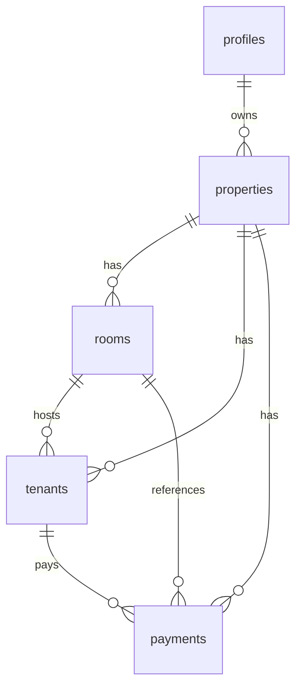

# DATABASE — KosManage

PostgreSQL on Supabase. Schema is the source of truth for integrity and authorization.

## Entity relationship

```text
profiles 1 ─── N properties
properties 1 ─── N rooms
rooms 1 ─── N tenants
tenants 1 ─── N payments
properties 1 ─── N tenants
properties 1 ─── N payments
```



## Tables

### profiles

| Column | Type | Nullable | Notes |
|--------|------|----------|-------|
| id | uuid | NO | PK, FK → `auth.users(id)` ON DELETE CASCADE |
| full_name | text | YES | |
| created_at | timestamptz | NO | default `now()` |
| updated_at | timestamptz | NO | default `now()` |

**Purpose:** App profile mirrored from auth user.  
**Indexes:** PK on `id`.

### properties

| Column | Type | Nullable | Notes |
|--------|------|----------|-------|
| id | uuid | NO | PK, default `gen_random_uuid()` |
| owner_id | uuid | NO | FK → `profiles(id)` ON DELETE CASCADE |
| name | text | NO | |
| address | text | YES | |
| created_at | timestamptz | NO | default `now()` |
| updated_at | timestamptz | NO | default `now()` |

**Purpose:** Boarding house (kos) owned by a user. MVP uses one primary property per owner (AS-001); schema allows many.  
**Indexes:** `idx_properties_owner_id` on `owner_id`.

### rooms

| Column | Type | Nullable | Notes |
|--------|------|----------|-------|
| id | uuid | NO | PK |
| property_id | uuid | NO | FK → `properties(id)` ON DELETE CASCADE |
| room_number | text | NO | unique per property |
| floor | int | YES | |
| price | numeric(12,2) | NO | CHECK `>= 0` |
| status | text | NO | `available` \| `occupied` \| `maintenance` |
| facilities | text | YES | free-text / comma-separated for MVP |
| notes | text | YES | |
| created_at | timestamptz | NO | default `now()` |
| updated_at | timestamptz | NO | default `now()` |

**Constraints:**
- `UNIQUE (property_id, room_number)`
- `CHECK (status IN ('available','occupied','maintenance'))`
- `CHECK (price >= 0)`

**Indexes:**
- `idx_rooms_property_id`
- `idx_rooms_property_status` on `(property_id, status)`

### tenants

| Column | Type | Nullable | Notes |
|--------|------|----------|-------|
| id | uuid | NO | PK |
| property_id | uuid | NO | FK → `properties(id)` ON DELETE CASCADE |
| room_id | uuid | YES | FK → `rooms(id)` ON DELETE RESTRICT; required when active |
| name | text | NO | |
| phone | text | YES | |
| email | text | YES | |
| identity_number | text | YES | KTP-like; dummy in seed |
| start_date | date | NO | |
| end_date | date | YES | |
| rent_price | numeric(12,2) | NO | CHECK `>= 0` |
| deposit | numeric(12,2) | YES | CHECK `>= 0` or NULL |
| status | text | NO | `active` \| `inactive` |
| notes | text | YES | |
| created_at | timestamptz | NO | default `now()` |
| updated_at | timestamptz | NO | default `now()` |

**Constraints:**
- `CHECK (status IN ('active','inactive'))`
- `CHECK (rent_price >= 0)`
- `CHECK (deposit IS NULL OR deposit >= 0)`
- `CHECK (end_date IS NULL OR end_date >= start_date)`
- `CHECK (status <> 'active' OR room_id IS NOT NULL)` — active tenant must have room
- **Partial unique:** `UNIQUE (room_id) WHERE status = 'active' AND room_id IS NOT NULL` — one active tenant per room

**Indexes:**
- `idx_tenants_property_id`
- `idx_tenants_room_id`
- `idx_tenants_property_status`

### payments

| Column | Type | Nullable | Notes |
|--------|------|----------|-------|
| id | uuid | NO | PK |
| property_id | uuid | NO | FK → `properties(id)` ON DELETE CASCADE |
| tenant_id | uuid | NO | FK → `tenants(id)` ON DELETE RESTRICT |
| room_id | uuid | YES | FK → `rooms(id)` ON DELETE SET NULL; denormalized snapshot of room at billing |
| billing_period | text | NO | e.g. `2026-03` (YYYY-MM) |
| due_date | date | NO | |
| amount_due | numeric(12,2) | NO | CHECK `>= 0` |
| amount_paid | numeric(12,2) | NO | default 0, CHECK `>= 0` |
| payment_date | date | YES | |
| payment_method | text | YES | `cash` \| `transfer` \| `ewallet` |
| status | text | NO | computed: `unpaid` \| `partial` \| `paid` \| `overdue` |
| notes | text | YES | |
| created_at | timestamptz | NO | default `now()` |
| updated_at | timestamptz | NO | default `now()` |

**Constraints:**
- `UNIQUE (tenant_id, billing_period)`
- `CHECK (amount_due >= 0 AND amount_paid >= 0)`
- `CHECK (status IN ('unpaid','partial','paid','overdue'))`
- `CHECK (payment_method IS NULL OR payment_method IN ('cash','transfer','ewallet'))`
- `CHECK (billing_period ~ '^[0-9]{4}-[0-9]{2}$')`

**Indexes:**
- `idx_payments_property_id`
- `idx_payments_tenant_id`
- `idx_payments_property_status`
- `idx_payments_due_date`
- `idx_payments_billing_period`

## Why these tables (and not more)

| Table | Business reason |
|-------|-----------------|
| profiles | Link auth user to app profile |
| properties | Multi-property-ready ownership root |
| rooms | Core inventory |
| tenants | Occupancy records |
| payments | Billing per period |

**Not in MVP:** `staff`, `roles`, `payment_transactions`, `notifications`, `documents`, `utilities` — no clear MVP business need (see ASSUMPTIONS).

## Status computation (payments)

Authoritative function `compute_payment_status(amount_due, amount_paid, due_date, as_of date default current_date)`:

1. If `amount_paid >= amount_due` → `paid`
2. Else if `as_of > due_date` → `overdue`
3. Else if `amount_paid > 0` → `partial`
4. Else → `unpaid`

`BEFORE INSERT OR UPDATE` trigger on `payments` sets `status` from this function. Client-supplied status is ignored/overwritten.

## Room occupancy sync

Trigger on `tenants` after insert/update/delete:

1. If tenant becomes `active` with `room_id`: set that room `status = occupied` (room must not be `maintenance` — enforced by trigger raising exception).
2. Recompute previous room (on room change or deactivate): if no remaining active tenants → set `available` **unless** current status is `maintenance`.
3. Reject assigning active tenant to room with status `maintenance`.
4. Reject assigning active tenant to room that already has another active tenant (partial unique also enforces).

## Updated_at

Shared trigger `set_updated_at()` on all tables before update.

## Profile provisioning

Trigger on `auth.users` after insert: create `profiles` row with `id = new.id`.

Optional: after profile create, do **not** auto-create property in DB trigger (keep explicit in app on first login) — app creates first property. Seed creates property for demo user.

## RLS summary

All tables enable RLS. Policies use ownership via `properties.owner_id = auth.uid()` (profiles use `id = auth.uid()`). See `SECURITY.md` for full policy matrix.

Helper (security definer, stable):

```sql
is_property_owner(p_property_id uuid) returns boolean
-- exists (select 1 from properties where id = p_property_id and owner_id = auth.uid())
```

## Migrations

| File | Purpose |
|------|---------|
| `supabase/migrations/20260326000000_init_kosmanage.sql` | Enums/checks, tables, indexes, functions, triggers, RLS |

## Seed

`supabase/seed.sql`:

- 1 owner profile (linked to a documented auth user UUID placeholder)
- 1 property
- 25 rooms (mix of available / occupied / maintenance)
- ~21 active tenants
- payments: paid, partial, unpaid, overdue mix

Seed uses dummy PII only. Auth user must exist or be created via Supabase Auth before FK to `auth.users` works — seed documents the expected flow.

## Dashboard query guidance

Prefer aggregate queries scoped by `property_id`:

- Room counts by status: `GROUP BY status`
- Active tenant count: `WHERE status = 'active'`
- Income this month: payments filtered by `billing_period` or `payment_date`
- Outstanding: `status IN ('unpaid','partial','overdue')`

Avoid unbounded selects without filters as data grows.
